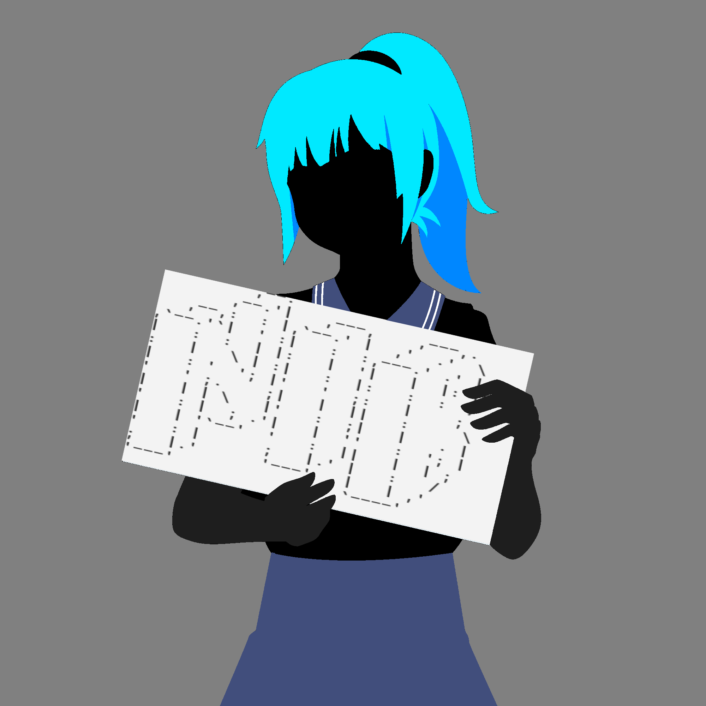
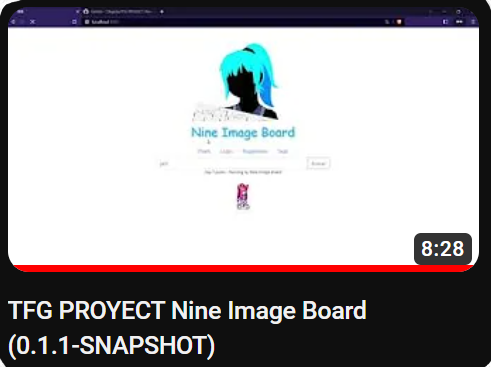

# ***NINE IMAGE BOARD***

<a href="#">
<br>
</a>

> [v0.1.1]

## Requisitos Minimos:


|                     | Version  |                                                                    |
| --------------------- | ---------- | -------------------------------------------------------------------- |
| Java                | 17       | ([Download](https://adoptium.net/es/temurin/releases/?version=17)) |
| MySql               | 8        |                                                                    |
| Node js             | v18.12.0 | ([Download](https://nodejs.org/dist/v18.12.0))                     |
| npm package manager | v8.19.2  |                                                                    |

## Uso e Instalación

* En Windows
  * > Lanzador Grafico    - APPSTART.exe                   -  ☑️
    >
  * > Lanzador de Consola - Start Auto.bat                 -  ☑️
    >
* En Linux
  * Pendiente

<b>Videos</b> </br>
<a href="https://youtu.be/7KrkzgEfUC0">
<br>
</a>

## Configuracion

* Automatica
  * config.properties

    ```
    # CONFIGURATION

    #Back Backend 
    NIB_B_Port = 3000
    NIB_B_ip = localhost
    NIB_B_user = root
    NIB_B_pass = root
    NIB_B_Version = 0.1.1-SNAPSHOT

    #Frontend
    NIB_F_Port = 8080
    NIB_F_ip = localhost

    #MySql
    MySql_Port = 3306
    MySql_ip = localhost
    MySql_user = root
    MySql_pass = root 
    MySql_bbdd = ninbooru


    #Personalize paths
    #javaPath=C:\\Program Files\\Eclipse Adoptium\\jdk-11.0.17.8-hotspot\\bin\\java.exe
    javaPath=C:\\Program Files\\Java\\jdk-17\\bin\\java.exe
    #ngPath=C:\\Users\\USUARIO\\AppData\\Roaming\\npm\\ng.cmd

    ```

## Soporte OS (Testado)

* [X] Windows 11
* [X] Windows 10
* [ ] Windows 7
* [ ] Ubuntu (Linux)
* [ ] Devian (Linux)
* [ ] MacOS
